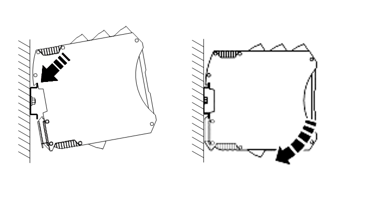

# Монтаж на DIN-рейку
Монтаж ПЛК1 в шкафу объекта эксплуатации осуществляется посредством несущей рейки, которая крепится непосредственно к монтажной панели шкафа. 
В качестве несущей рейки должна использоваться DIN-рейка шириной 35 мм.

Типы применяемой DIN-рейки:

- **TS-35/7.5;** 
- **TS-35/15.**

Необходимое количество шинных соединителей соединяются между собой с помощью соединителей, расположенных по бокам. Соединенные между собой шинные 
соединители крепятся на DIN-рейку с помощью специальных пружинных захватов.

После установки шинных соединителей на DIN-рейку на них монтируются модули. Для установки модуля сначала производится зацепление крепления в районе 
верхней части соединителя, а затем путем нажатия на нижнюю часть модуля он со щелчком закрепляется на соединителе. 

Для отсоединения модуля нужно сначала с помощью отвертки оттянуть защелку, расположенную в нижней части модуля, затем потянуть за нижнюю часть и после отсоединения модуля от шинного соединителя небольшим движением вверх вывести его из крепления 

